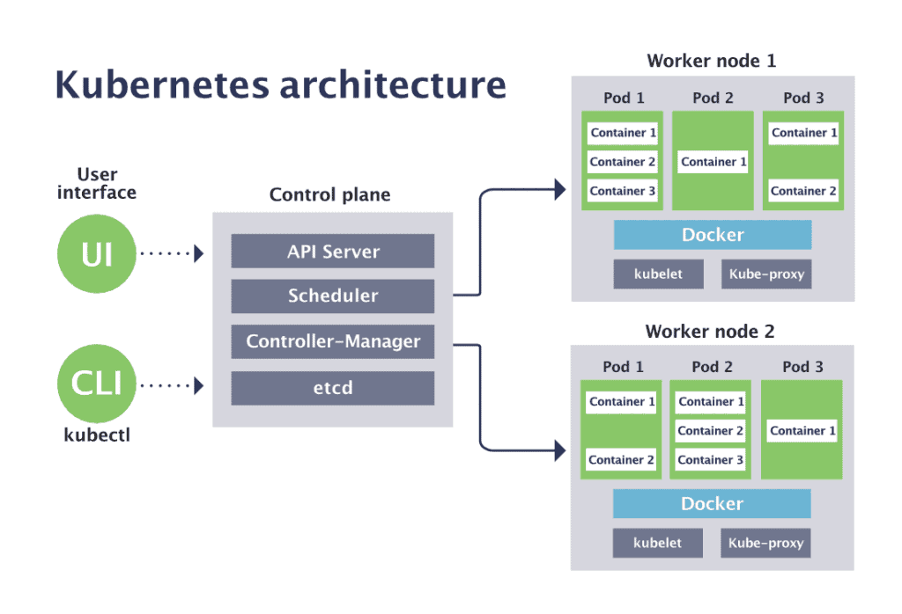

# ☸️ Pods

## 1. What is a Pod?

A Pod is the **smallest deployable unit in Kubernetes**.

Kubernetes does not directly manage containers as its basic workload
unit. Instead, containers run inside Pods.

```text
Kubernetes
     |
     ↓
    Pod
     |
     ↓
Container
```
A Pod can contain:

- One container (most common)
- Multiple containers that need to work closely together

**Why does Kubernetes use Pods?**

Kubernetes needs a unit around which it can manage:

- Networking
- Storage
- Container lifecycle
- Scheduling
- Resource allocation
- Configuration

Therefore, Kubernetes places one or more closely related containers
inside a Pod.

---
## 2. Pod vs Container

A common beginner mistake is thinking:

Pod = Container

They are not the same.
```
Pod
│
├── Container
├── Shared Network
└── Shared Storage
```
A Pod is a Kubernetes abstraction that can contain containers.

**Example**

Suppose we have an application container and a logging sidecar:
```
             Pod
              |
       ┌──────┴──────┐
       ↓             ↓
 Application      Logging
 Container        Container
```
Both containers can share the Pod's network namespace and can
communicate with each other using localhost.

---
## 3. Creating a Pod

Example:
```
apiVersion: v1
kind: Pod

metadata:
  name: nginx-pod

spec:
  containers:
    - name: nginx
      image: nginx:latest
```
**Explaination**
| Field        | Meaning                                      |
|--------------|----------------------------------------------|
| `apiVersion` | Kubernetes API version used by the resource |
| `kind`       | Type of Kubernetes object                    |
| `metadata`   | Information about the object                 |
| `name`       | Name of the Pod                              |
| `spec`       | Desired configuration                        |
| `containers` | Containers that should run                   |
| `image`      | Container image to use                       |

---
## 4. Useful Commands

**Create the Pod**
```
kubectl apply -f pod.yaml
```
**List Pods**
```
kubectl get pods
```
**Detailed information**
```
kubectl describe pod nginx-pod
```
**View logs**
```
kubectl logs nginx-pod
```
**Delete Pod**
```
kubectl delete pod nginx-pod
```
---

## 🎯 Interview Question
**Q: Is a Pod the same as a container?**

Answer: No.

A Pod is a Kubernetes abstraction that provides an execution
environment for one or more containers. A Pod can contain multiple
closely related containers that share networking and storage.
